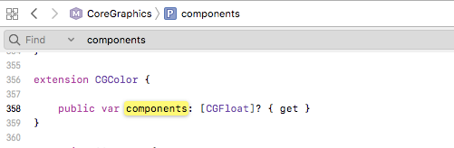
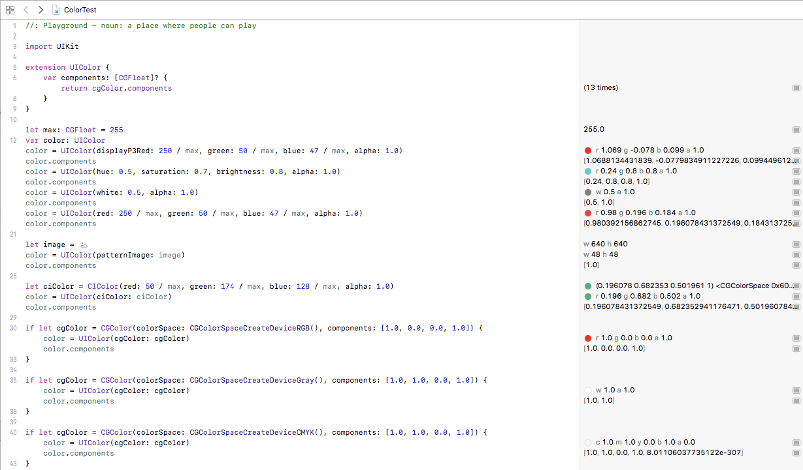

# 前置き
UIColorのカラーコードとアルファ値を取り出すのに[`cgColor.components`を使う方法](https://qiita.com/KikurageChan/items/e1c00c53364e6e3e423a)を[紹介](https://qiita.com/417_72ki/items/31fcc8ec2a856259eee6#comment-7ae5c9e9622e5350c80f)して貰いましたが、ここで新たな疑問が発生しました。

# `components`プロパティ

CoreGraphics内では以下のように定義されています



```swift
extension CGColor {

    public var components: [CGFloat]? { get }
}
```

`[CGFloat]?`...だと...?

ところが[公式Doc](https://developer.apple.com/documentation/coregraphics/cgcolor/2427146-components)を見てもこいつが`nil`になるケースについて言及されていません。

# 実際に調べてみた

とりあえず考えられる限りのパターンで生成した`UIColor`の`components`を取り出してみました。

<details><summary>コードはこちら</summary><div>

```swift
//: Playground - noun: a place where people can play

import UIKit

extension UIColor {
    var components: [CGFloat]? {
        return cgColor.components
    }
}

let max: CGFloat = 255
var color: UIColor
color = UIColor(displayP3Red: 250 / max, green: 50 / max, blue: 47 / max, alpha: 1.0)
color.components
color = UIColor(hue: 0.5, saturation: 0.7, brightness: 0.8, alpha: 1.0)
color.components
color = UIColor(white: 0.5, alpha: 1.0)
color.components
color = UIColor(red: 250 / max, green: 50 / max, blue: 47 / max, alpha: 1.0)
color.components

let image = #imageLiteral(resourceName: "hoge.jpg")
color = UIColor(patternImage: image)
color.components

let ciColor = CIColor(red: 50 / max, green: 174 / max, blue: 128 / max, alpha: 1.0)
color = UIColor(ciColor: ciColor)
color.components

if let cgColor = CGColor(colorSpace: CGColorSpaceCreateDeviceRGB(), components: [1.0, 0.0, 0.0, 1.0]) {
    color = UIColor(cgColor: cgColor)
    color.components
}

if let cgColor = CGColor(colorSpace: CGColorSpaceCreateDeviceGray(), components: [1.0, 1.0, 0.0, 1.0]) {
    color = UIColor(cgColor: cgColor)
    color.components
}

if let cgColor = CGColor(colorSpace: CGColorSpaceCreateDeviceCMYK(), components: [1.0, 1.0, 0.0, 1.0]) {
    color = UIColor(cgColor: cgColor)
    color.components
}
```
</div>
</details>

# 結果


結局`cgColor.components`が`nil`になるケースは発見できませんでした。
(誰か知ってる方いたら教えてくだちい...)
とはいえ、グレースケールだと`cgColor.components`の要素が`white`と`alpha`の2つになることが分かったので`cgColor.components`でRGBを取り出そうとするのはちょっと危ないなと思いました。

# 結論
大人しく`getRed(green:blue:alpha:)`を使おう
