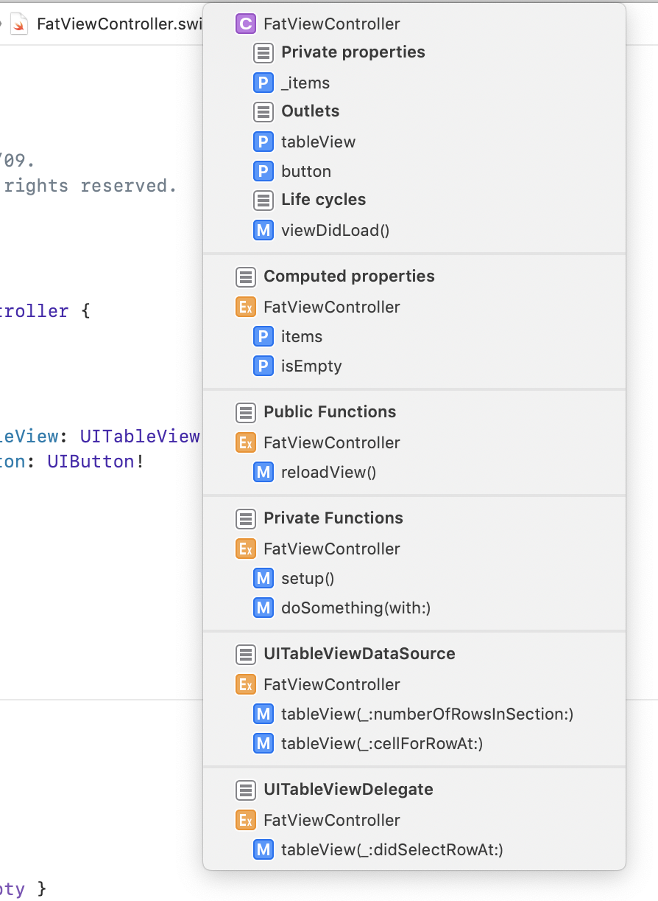
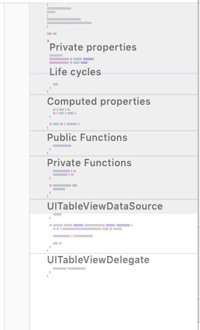

iOS Advent Calendar 2019も折り返しに来ました。担当の@417_72kiです。

*protocol*毎にextensionでコードブロックを分けるという有名(?)なhackがありますが、
今回は*protocol*以外でも積極的に*extension*で分けていこうぜ！っていう記事を書きました。

# 注意
どう呼べばいいか困ったものについて、この記事では以下のように定義しています。

- **definition block** -> *class*/*struct*/*enum*宣言したブロック( `class Hoge {~}`で囲まれたブロック )
- **extension block** -> *extension*宣言したブロック ( `extension Hoge {~}` で囲まれたブロック )

以下、上記の言葉は**太字**で記述していきます。

# ベタ書きされたコード
例としてこんなFatViewControllerを考えます(アーキテクチャの話は一旦無視します)。
<details><summary>ベタ書きされたFatViewController</summary><div>

```swift:FatViewController.swift
class FatViewController: UIViewController, UITableViewDataSource, UITableViewDelegate {

    private var _items: [Item]?

    var items: [Item] {
        get { _items ?? [] }
        set { _items = newValue }
    }

    var isEmpty: Bool { items.isEmpty }

    @IBOutlet private weak var tableView: UITableView!
    @IBOutlet private weak var button: UIButton!

    override func viewDidLoad() {
        super.viewDidLoad()

        setup()
    }

    private func setup() {
        tableView.dataSource = self
        tableView.delegate = self
    }

    private func doSomething(with item: Item) {
        print(item.name)
    }

    func reloadView() {
        tableView.reloadData()
    }

    // MARK: - UITableViewDataSource
    func tableView(_ tableView: UITableView, numberOfRowsInSection section: Int) -> Int {
        items.count
    }

    func tableView(_ tableView: UITableView, cellForRowAt indexPath: IndexPath) -> UITableViewCell {
        let cell = tableView.dequeueReusableCell(withIdentifier: "Cell", for: indexPath)

        cell.textLabel?.text = items[indexPath.row].name

        return cell
    }

    // MARK: - UITableViewDelegate
    func tableView(_ tableView: UITableView, didSelectRowAt indexPath: IndexPath) {
        doSomething(with: items[indexPath.row])
    }

}
```
</div></details>

## ステップ1: *protocol*を分割する
これについては[参考記事がある](https://dev.classmethod.jp/etc/protocol-extension-form/)のでここでの解説は割愛します。

<details><summary>protocol分割されたFatViewController</summary><div>

```swift:FatViewController.swift
class FatViewController: UIViewController {
    private var _items: [Item]?

    var items: [Item] {
        get { _items ?? [] }
        set { _items = newValue }
    }

    var isEmpty: Bool { items.isEmpty }

    @IBOutlet private weak var tableView: UITableView!
    @IBOutlet private weak var button: UIButton!

    override func viewDidLoad() {
        super.viewDidLoad()

        setup()
    }

    private func setup() {
        tableView.dataSource = self
        tableView.delegate = self
    }

    private func doSomething(with item: Item) {
        print(item.name)
    }

    func reloadView() {
        tableView.reloadData()
    }
}

// MARK: - UITableViewDataSource
extension FatViewController: UITableViewDataSource {
    func tableView(_ tableView: UITableView, numberOfRowsInSection section: Int) -> Int {
        items.count
    }

    func tableView(_ tableView: UITableView, cellForRowAt indexPath: IndexPath) -> UITableViewCell {
        let cell = tableView.dequeueReusableCell(withIdentifier: "Cell", for: indexPath)

        cell.textLabel?.text = items[indexPath.row].name

        return cell
    }
}

// MARK: - UITableViewDelegate
extension FatViewController: UITableViewDelegate {
    func tableView(_ tableView: UITableView, didSelectRowAt indexPath: IndexPath) {
        doSomething(with: items[indexPath.row])
    }
}
```
</div></details>

ちなみに、*protocol function*を*extension*に切り出したら`// MARK: - ~`を消している記事をよく見かけますが、筆者はあえて各**extension block**に対して`// MARK: - ~`を付けるようにしています。
理由は[後述](#markとminimap)します。

## ステップ2: *function*を分割する
*function*は基本的に*extension*に切り出すことができます。
*class*における*override function*は例外で、**definition block**にしか定義できないため、`// MARK:`で区切ります。

<details><summary>*function*分割されたFatViewController</summary><div>


```swift:FatViewController.swift
class FatViewController: UIViewController {
    private var _items: [Item]?

    var items: [Item] {
        get { _items ?? [] }
        set { _items = newValue }
    }

    var isEmpty: Bool { items.isEmpty }

    @IBOutlet private weak var tableView: UITableView!
    @IBOutlet private weak var button: UIButton!

    // MARK: Life cycles
    override func viewDidLoad() {
        super.viewDidLoad()

        setup()
    }
}

// MARK: - Functions
extension FatViewController {
    private func setup() {
        tableView.dataSource = self
        tableView.delegate = self
    }

    private func doSomething(with item: Item) {
        print(item.name)
    }

    func reloadView() {
        tableView.reloadData()
    }
}

// MARK: - UITableViewDataSource
extension FatViewController: UITableViewDataSource {
    func tableView(_ tableView: UITableView, numberOfRowsInSection section: Int) -> Int {
        items.count
    }

    func tableView(_ tableView: UITableView, cellForRowAt indexPath: IndexPath) -> UITableViewCell {
        let cell = tableView.dequeueReusableCell(withIdentifier: "Cell", for: indexPath)

        cell.textLabel?.text = items[indexPath.row].name

        return cell
    }
}

// MARK: - UITableViewDelegate
extension FatViewController: UITableViewDelegate {
    func tableView(_ tableView: UITableView, didSelectRowAt indexPath: IndexPath) {
        doSomething(with: items[indexPath.row])
    }
}
```
</div></details>

## ステップ3: *computed property*を分割する
*property*のうち、*computed property*は*extension*に切り出すことができます。
*stored property*は**definition block**にしか定義できないため、必要に応じて`// MARK:`で区切ったりします。

<details><summary>computed property分割されたFatViewController</summary><div>

```swift:FatViewController.swift
class FatViewController: UIViewController {
    // MARK: Private properties
    private var _items: [Item]?

    // MARK: Outlets
    @IBOutlet private weak var tableView: UITableView!
    @IBOutlet private weak var button: UIButton!

    // MARK: Life cycles
    override func viewDidLoad() {
        super.viewDidLoad()

        setup()
    }
}

// MARK: - Computed properties
extension FatViewController {
    var items: [Item] {
        get { _items ?? [] }
        set { _items = newValue }
    }

    var isEmpty: Bool { items.isEmpty }
}

// MARK: - Functions
extension FatViewController {
    private func setup() {
        tableView.dataSource = self
        tableView.delegate = self
    }

    private func doSomething(with item: Item) {
        print(item.name)
    }

    func reloadView() {
        tableView.reloadData()
    }
}

// MARK: - UITableViewDataSource
extension FatViewController: UITableViewDataSource {
    func tableView(_ tableView: UITableView, numberOfRowsInSection section: Int) -> Int {
        items.count
    }

    func tableView(_ tableView: UITableView, cellForRowAt indexPath: IndexPath) -> UITableViewCell {
        let cell = tableView.dequeueReusableCell(withIdentifier: "Cell", for: indexPath)

        cell.textLabel?.text = items[indexPath.row].name

        return cell
    }
}

// MARK: - UITableViewDelegate
extension FatViewController: UITableViewDelegate {
    func tableView(_ tableView: UITableView, didSelectRowAt indexPath: IndexPath) {
        doSomething(with: items[indexPath.row])
    }
}
```
</div></details>

## ステップ4: accessibleごとに分割する
*extension*にも[Access Level](https://docs.swift.org/swift-book/LanguageGuide/AccessControl.html#ID5)を設定することができます。
ブロック内のAccess Levelはブロック本体のAccess Level以下になります
(ただし、トップレベルのブロックにおける`private`は`fileprivate`と同義になります)。

そこで、分割した*extension*を更にAccess Levelごとに分割することで、ブロック単位でAccess Levelを設定できるとともに`private`の付け忘れから開放されます。

<details><summary>accessibleごとに分割されたFatViewController</summary><div>
※ *private*な*computed property*の良い例が思いつかなかったため、ここでは*function*だけ対応しています

```swift:FatViewController.swift
class FatViewController: UIViewController {

    // MARK: Private properties
    private var _items: [Item]?

    // MARK: Outlets
    @IBOutlet private weak var tableView: UITableView!
    @IBOutlet private weak var button: UIButton!

    // MARK: Life cycles
    override func viewDidLoad() {
        super.viewDidLoad()

        setup()
    }
}

// MARK: - Computed properties
extension FatViewController {
    var items: [Item] {
        get { _items ?? [] }
        set { _items = newValue }
    }

    var isEmpty: Bool { items.isEmpty }
}

// MARK: - Public Functions
extension FatViewController {
    func reloadView() {
        tableView.reloadData()
    }
}

// MARK: - Private Functions
private extension FatViewController {
    func setup() {
        tableView.dataSource = self
        tableView.delegate = self
    }

    func doSomething(with item: Item) {
        print(item.name)
    }
}

// MARK: - UITableViewDataSource
extension FatViewController: UITableViewDataSource {
    func tableView(_ tableView: UITableView, numberOfRowsInSection section: Int) -> Int {
        items.count
    }

    func tableView(_ tableView: UITableView, cellForRowAt indexPath: IndexPath) -> UITableViewCell {
        let cell = tableView.dequeueReusableCell(withIdentifier: "Cell", for: indexPath)

        cell.textLabel?.text = items[indexPath.row].name

        return cell
    }
}

// MARK: - UITableViewDelegate
extension FatViewController: UITableViewDelegate {
    func tableView(_ tableView: UITableView, didSelectRowAt indexPath: IndexPath) {
        doSomething(with: items[indexPath.row])
    }
}
```
</div></details>

## 他に*extension*に切り出せるもの
### <details><summary>クラス定数(`static let`)</summary><div>
```swift:FatViewController.swift
// MARK: - Constants
extension FatViewController {
    static let initialItems: [Item] = [] // -> OK
    let initialItems: [Item] = [] // -> NG
}
```
</div></details>

同じ定数でもインスタンス定数の方は*extension*に切り出せません。
不思議ですね(棒

### <details><summary>inner class/struct/enum</summary><div>
```swift:FatViewController.swift
// MARK: - State
extension FatViewController {
    enum State {
        case hoge
        case fuga
        case foo
        case bar
    }
}

// MARK: -
extension FatViewController.State {
    var isHoge: Bool { self == .hoge }
}
```
</div></details>

もちろんネストされた型に対してもextensionを貼ることができますし、
その中に更にネスト型を定義することもできます。
ブロックのネストを増やすことなく型のネストを増やせるので、複雑なJSONからCodableなstructを組み立てる時に重宝します。

ちなみに、[BuildConfig.swift](https://github.com/417-72KI/BuildConfig.swift)という自作ツールで生成されるSwiftファイルもこの手法を使っています。
よかったら実際に使ってみて生成されたコードを見てみてください(宣伝

### その他
実装する機会が減ってきたのでここでは触れませんが、*convenience initializer*もextensionで定義することができます。

## `// MARK:`とパンくずリストとMinimap
Xcodeのエディタ領域上部にあるパンくずリストで、ファイル名の次の要素を開くと*Document Items*が表示されます。
(`^+6`でも開きます)

`// MARK: 見出し名`を使うことでこの*Document Items*に見出しを付けることができます。
また、 `MARK: - 見出し名`とすることで、見出しの前に区切り線を付けることができます。


更に、Xcode11で登場した*minimap*では`// MARK: 見出し名`を付けた所に見出しが表示されるようになります。
*Document Items*と同様、こちらも`-`付きMARKにすると区切り線が付きます。



先述の、筆者が全ブロックに`MARK: - 見出し名`を付ける理由がこれです。
見出しが付くおかげでコードの構造がパッと見で分かるようになりますね。

# まとめ
extensionを活用してコードブロックを整理することで、各ブロックに役割を持たせる事ができます。
また、MARKコメントとminimapとの組み合わせでコードの見通しも良くなってDXも爆アゲです。

この1年ずっとこの手法を使っていますが今の所デメリットが見つかっていないので、
誰かこの手法で困ったことがあったら教えていただきたいです(※他の言語ではできないみたいなのは除く)。

それでは皆様、良いお年を！✋

# 参考
[Using Swift Extensions The “Wrong” Way - Natasha The Robot](https://www.natashatherobot.com/using-swift-extensions/)(@NatashaTheRobot)
[【Swift】Protocolごとにextensionで切り分けて実装するワケ](https://dev.classmethod.jp/etc/protocol-extension-form/)(@ktanaka117)
[[Xcode 8] Swiftのドキュメントコメントについての簡潔なまとめ](https://qiita.com/y-some/items/8bc06567eee18dfeafbb#%E7%89%B9%E6%AE%8A%E3%82%BF%E3%82%B0)(@y-some)
[What's New in Xcode 11](https://qiita.com/akatsuki174/items/c9355fadf6654f19d52d)(@akatsuki174)
