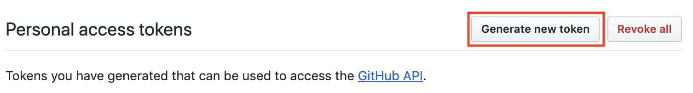
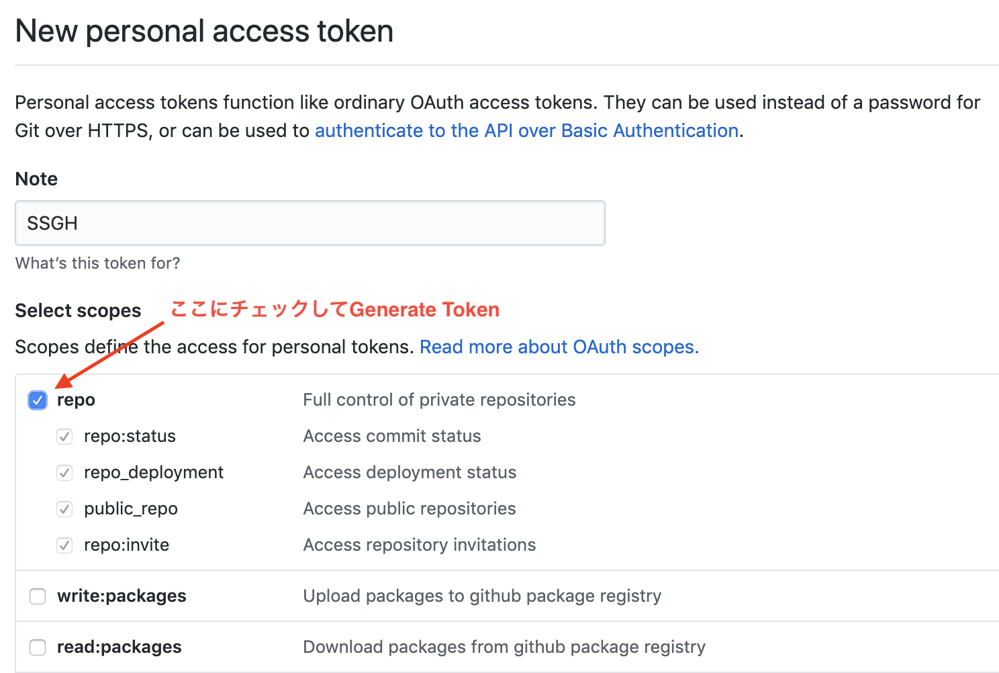
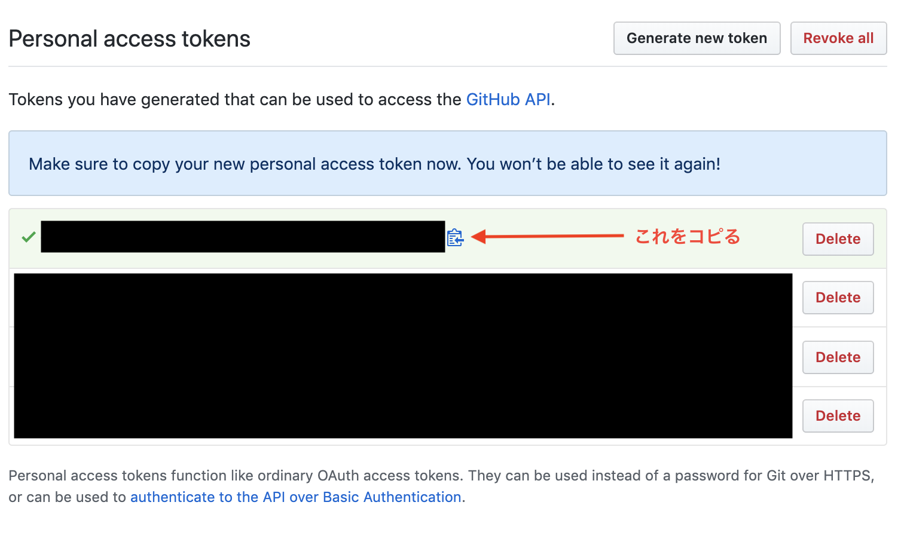

[Swift/Kotlin愛好会 Advent Calendar 2019](https://qiita.com/advent-calendar/2019/love_swift_kotlin)の空き枠を埋めに来ました。

# 作ったもの
https://github.com/417-72KI/SSGH

# インストール

Homebrew対応させました

```sh
$ brew tap 417-72KI/SSGH
$ brew install ssgh
```

# 使い方
## GitHubトークンが必要なのではじめに作ります






## できたトークンを環境変数にセットします

```sh:.bashrc
export SSGH_TOKEN='{コピってきたトークン}'
```

## 後はGitHubのアカウントを指定してコマンドを叩くだけ！

```sh
ssgh 417-72KI
```

# 仕組み
やっていることは非常に単純ですが、GitHub APIの仕様に癖があって微妙に苦戦しました。

- ユーザ情報取得 ([`GET /users/:username`](https://developer.github.com/v3/users/#get-a-single-user))
- リポジトリリスト取得 ([`GET /users/:username/repos`](https://developer.github.com/v3/repos/#list-user-repositories))
- 各リポジトリごとにスター済みか確認 ([`GET /user/starred/:owner/:repo`](https://developer.github.com/v3/activity/starring/#check-if-you-are-starring-a-repository))
- スターしていないリポジトリにスターを付ける([`PUT /user/starred/:owner/:repo`](https://developer.github.com/v3/activity/starring/#star-a-repository))

リポジトリリストから取得できたエンティティにはスター済みかのフラグが無いため、各リポジトリに対してスター済みか確認するAPIを叩く必要があります。
このスター済み確認API、なんとレスポンスは空っぽで、

- スター済みならステータス204
- 未スターならステータス404

という不思議な仕様になっています。
そのため、レスポンスのステータスコードを見て404なら正常系として扱うようにエラーハンドリングをゴニョゴニョする必要がありました。
奮闘の結果は[こちら](https://github.com/417-72KI/SSGH/blob/master/Sources/GitHubAPI/Starred.swift)を御覧ください(

## 使ったもの
- [APIKit](https://github.com/ishkawa/APIKit)
- [Commander](https://github.com/kylef/Commander)

# TODO
- ターゲット複数指定爆撃
- フォロワー全員に爆撃

# 余談
名前の由来ですが、7年くらい前に流行った[ShootingStar](https://octoba.net/archives/20120514-android-app-4.html)というTwitterクライアントをリスペクトしています。
当時のTwitterは「いいね」ではなく「お気に入り(ふぁぼ)」があり、そのアイコンが☆でした。
また、[ふぁぼ爆撃](https://www.weblio.jp/content/%E3%81%B5%E3%81%81%E3%81%BC%E7%88%86%E6%92%83)という文化もあり爆撃専用に作られたのがShootingStarというクライアントでした。

# 終わりに
誰かから「スターください」って言われたらこのツールを使って爆撃していってください。

そしてこの記事を見たそこのあなた、後は分かるね？(
