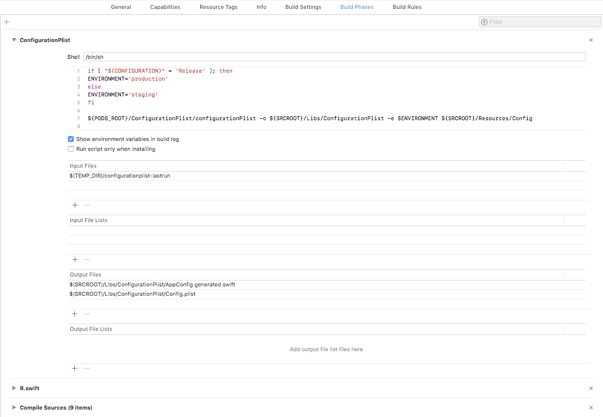

# はじめに
ビルド環境によって値を変えたいシーンってよくありますよね。
これまでにも色々なところで様々なアプローチが提案/実施されてきたと思いますが、自分の中でようやく1つの答えに辿り着いた気がするので共有します。

# これまで
まず、自分がこれまでiOS開発で関わってきた中でどのように実装してきたかを振り返ります。

## Objective-C時代

```ObjC:HogePrefix.pch
#ifdef DEBUG
#define HOGE @"foo"
#else
#define HOGE @"bar"
#endif
```

ObjCといえばプリプロセッサマクロですね。
`~Prefix.pch`なんてのはObjC時代からやってるエンジニアには馴染み深いファイルだと思います。
この`~Prefix.pch`に↑のような`#ifdef`+`#define`が大量に列挙されて~~節子~~FatViewControllerも真っ青な一大ファイルの出来上がり！(死

## ~Swift3.x

```swift:Define1.swift
#if DEBUG
let hoge = "foo"
#else
let hoge = "bar"
#endif

let fuga: String = {
  #if DEBUG
  return "foo"
  #else
  return "bar"
  #endif
}()
```

型について厳しくなったため多少はマシになりましたが、
結局内部でマクロによって分岐するしそもそも値がコードに入り込んでいるという点で本質的にはほとんど変わらないですね。

[**Build Settings**の**User-Defined**でビルド毎に違う値をセットする](https://dev.classmethod.jp/smartphone/iphone/ios-user-defined/)という方法もありますが、この方法は`Info.plist`が汚れるので個人的にあまりやりたくありません。

そこで、別のファイルに実際の値を外出しし、コード側でそのファイルを読み込むことにより、
環境毎に読み込むファイルを変えるだけで環境の切り替えをできるようにしました。

当時は**[SwiftyJSON](https://github.com/SwiftyJSON/SwiftyJSON)**が全盛だったこともあり、

```json:Config-Dev.json
{
  "hoge": "foo"
}
```

```json:Config.json
{
  "hoge": "bar"
}
```

```swift:Config.swift
let config: JSON = {
    let file: String = {
        #if DEBUG
        return "Config-Dev"
        #else
        return "Config"
        #endif
    }()
    let path = Bundle.main.path(forResource: file, ofType: "json")!
    let data = try! Data(contentsOf: URL(fileURLWithPath: filePath))
    return JSON(data: data)
}
let hoge = config["hoge"].stringValue
```

という感じでやっていました。

これは**SwiftJSON**の`JSON`が`subscript`でも`JSON`を返すことを利用して、
ネストが深くなっても`json["key1"]["key2"][0].stringValue`みたいにシンプルに呼べるというメリットがあったんですが、それ以上に`subscript`のキーで事故るリスクが大きいという問題がありました。
`String`を直打ちするのでキーの補完も効かないからキー名が長ければ長いほど地獄...

## Swift4~

Swift4になって`Codable`が登場したことで、同じ構造の`struct`を定義してそこにファイルを流し込む
ことにより、先の**SwiftyJSON**を使うメリットを踏襲しつつデメリットも大幅に削減できるようになりました。

```swift:Config.swift
struct Config: Codable {
  let hoge: String
}

let config: Config = {
    let file: String = {
        #if DEBUG
        return "Config-Dev"
        #else
        return "Config"
        #endif
    }()
    let path = Bundle.main.path(forResource: file, ofType: "json")!
    let data = try! Data(contentsOf: URL(fileURLWithPath: filePath))
    return try! JSONDecoder().decode(Config.self, from: data)
}

let hoge = config.hoge
```

# 振り返り終わり

さて、ここまででもかなり変数管理は楽になったのですが、新たな問題(というか欲)が出てきました。

1. 読み込ませるファイルをマクロ(`#if DEBUG`)で切り替えるのをやめたい
1. 環境では変わらない値(APIのパスとか)も外出ししたい(定数値管理)
1. 管理する値の種類毎にファイルを分けたい(単一ファイル管理時のコンフリクト防止)
1. どうせならYAMLで書いた設定ファイルをマージして設定ファイルを生成するようにしたい
1. Config.swiftがボイラープレートになりそうだから自動生成させたい

ということで、これらを一気に実現するために[**BuildConfig.swift**](https://github.com/417-72KI/BuildConfig.swift
)というCLIツールを作りました。

# BuildConfig.swift
YAMLやJSONで書かれた設定ファイルをマージしてPListを生成します。
もちろん、環境に応じて読み込むファイルを切り替える仕組みも用意しています。
更に、そのPListの構造を保持したSwiftコードを自動生成します。

## 使い方
### CocoaPodsでインストールします。

```ruby:Podfile
pod 'BuildConfig.swift', '~> 2.0'
```

### こんな感じでファイルを用意します(例)

```yaml:$(SRCROOT)/Resources/Config/API.yml
API:
  path:
    login:
      method: POST
      path: /auth
    getList:
      method: GET
      path: /list
```

```yaml:$(SRCROOT)/Resources/Config/Link.yml
Link:
  twitter: https://twitter.com/417_72ki
  github: https://github.com/417-72KI
  qiita: https://qiita.com/417_72ki
```

```yaml:$(SRCROOT)/Resources/Config/.env/staging.yml
API:
  domain: https://localhost
  
```

```yaml:$(SRCROOT)/Resources/Config/.env/production.yml
API:
  domain: https://foo.bar.co.jp
  
```

### Build PhaseにRun Scriptを追加します

```shell
if [ "${CONFIGURATION}" = 'Release' ]; then
ENVIRONMENT='production'
else
ENVIRONMENT='staging'
fi

${PODS_ROOT}/BuildConfig.swift/buildconfigswift -o ${SRCROOT}/Libs/BuildConfig_swift -e $ENVIRONMENT ${SRCROOT}/Resources/Config
```

`-o`で生成ファイルの出力先、`-e`で読み込む環境を指定し、最後に読み込むymlファイルがまとまっているディレクトリを指定します。
※`.env`フォルダの下に置くファイルは、`-e`で指定する環境と同じ名前にしてください。

また、Run ScriptのInput Filesに
`$(TEMP_DIR)/buildconfigswift-lastrun`
、Output Filesに
`$(SRCROOT)/Libs/BuildConfig_swift/BuildConfig.generated.swift`
と
`$(SRCROOT)/Libs/BuildConfig_swift/BuildConfig.plist`
をそれぞれ追加します。
(※生成先に制約はありませんが、`-o`で指定した出力先とOutput Filesのパスは一致するようにする必要があります。)



### あとはビルドするだけ
こんな感じでファイルが生成されます。
<details>
<summary>`$(SRCROOT)/Libs/BuildConfig_swift/BuildConfig.plist`</summary><div>

```xml:$(SRCROOT)/Libs/BuildConfig_swift/BuildConfig.plist
<?xml version="1.0" encoding="UTF-8"?>
<!DOCTYPE plist PUBLIC "-//Apple//DTD PLIST 1.0//EN" "http://www.apple.com/DTDs/PropertyList-1.0.dtd">
<plist version="1.0">
    <dict>
        <key>API</key>
        <dict>
            <key>path</key>
            <dict>
                <key>login</key>
                <dict>
                    <key>path</key>
                    <string>/auth</string>
                    <key>method</key>
                    <string>POST</string>
                </dict>
                <key>getList</key>
                <dict>
                    <key>path</key>
                    <string>/list</string>
                    <key>method</key>
                    <string>GET</string>
                </dict>
            </dict>
            <key>domain</key>
            <string>https://localhost</string>
        </dict>
        <key>Links</key>
        <dict>
            <key>twitter</key>
            <string>https://twitter.com/417_72ki</string>
            <key>qiita</key>
            <string>https://qiita.com/417_72ki</string>
            <key>github</key>
            <string>https://github.com/417-72KI</string>
        </dict>
    </dict>
</plist>
```
</div></details>
<details>
<summary>`$(SRCROOT)/Libs/BuildConfig_swift/BuildConfig.generated.swift`</summary><div>

```swift:$(SRCROOT)/Libs/BuildConfig_swift/BuildConfig.generated.swift
import Foundation

struct BuildConfig: Codable {
    static let `default`: BuildConfig = .load()

    let API: API
    let Links: Links

    enum CodingKeys: String, CodingKey {
        case API
        case Links
    }
}
// 以下略
```
</div></details>

※`BuildConfig.plist`は実際にはバイナリ形式で出力されます。

### 呼び出し
`BuildConfig.default`でルートオブジェクトにアクセスすることができます。
あとは、YAMLに書いていたキーをドットで繋いでいけば目的の値が読み出せるはずです。
例: `BuildConfig.default.API.path.login.path` => `/auth`

## 実際に使ってみて
ちょうど今スクラッチ開発の案件が続いているので、それに組み込みつつ改修をかけています。

### 良かったこと
- yamlで管理できるようになったことで設定値が見やすくなった
- ファイル分割できるようになったことで値が探しやすくなった
- 自動生成されるファイルは当然`.gitignore`に登録するので、コンフリクト地獄も解消
- `Info.plist`を汚すことなく設定値を増やしたり減らしたりできる
    - 当然キーのtypoによる余計なバグも無くなる!
- `#if DEBUG`からの脱却
- `BuildConfig.plist`をバイナリ化したことである程度軽量化できた

### 別途生まれたつらみ
- 新しいビルドシステムでビルドに失敗したり値が更新されなかったりする事象が発生  
  [R.swiftがちょうど同じ問題に直面していた](https://qiita.com/417_72ki/items/1abca0a89a664e20e7d1)ため、その解決方法を拝借してクリアしました。
- Xcodeではyamlを直接開けないため、デュアルディスプレイが半必須になった  
  とはいえ、デュアルディスプレイが前提の開発環境なら問題にならないし、シングルでも値が散らばって探す手間を考えたら個人的にはマシかなと思ってます。  
  今は外部ディスプレイでXcode、MacbookのメインディスプレイでVSCodeを開いて作業しています  
- yamlのパーサが手強い  
  yamlの仕様上、スカラー値が全てStringでも取れるため、型の判定処理がかなりつらいことになっています(今も`Double`が上手く取れてなくて😱なことに...)  
  あとPListでサポートされている型の一部の対応がまだできていないのも課題...

最後の課題についてはちょうど今スクラッチ開発が続いているので、組み込みながら改修していきたいと思ってます。

# まとめ
- ビルド環境で変わる値はファイルに外出しできると幸せになれる😇
- 自動生成最高！
- [**BuildConfig.swift**](https://github.com/417-72KI/BuildConfig.swift
)使ってね！(

# 余談
こういう値って**環境変数**って呼んでいいものなのだろうか🤔
