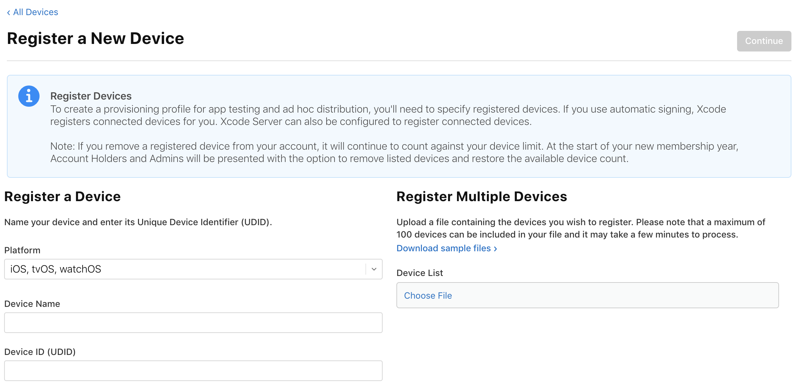

# TL;DR

この右側の`Choose File`で複数のUDIDをまとめて登録できるのだが、そのフォーマットが変わっており以前使っていたファイルでエラーが出た。

# Before
```
Device ID    Device Name
xxxxxxxxxxxxxxxxxxxxxxxxxxxxxxxxxxxxxxxx    hoge
xxxxxxxxxxxxxxxxxxxxxxxxxxxxxxxxxxxxxxxx    fuga
xxxxxxxxxxxxxxxxxxxxxxxxxxxxxxxxxxxxxxxx    foo
xxxxxxxxxxxxxxxxxxxxxxxxxxxxxxxxxxxxxxxx    bar
```
※カラムの区切りはスペース4つ

# After
```
Device ID	Device Name	Device Platform
xxxxxxxxxxxxxxxxxxxxxxxxxxxxxxxxxxxxxxxx	hoge	ios
xxxxxxxxxxxxxxxxxxxxxxxxxxxxxxxxxxxxxxxx	fuga	ios
xxxxxxxxxxxxxxxxxxxxxxxxxxxxxxxxxxxxxxxx	foo	ios
xxxxxxxxxxxxxxxxxxxxxxxxxxxxxxxxxxxxxxxx	bar	ios
```
※カラムの区切りはタブスペース

# 対応
- スペース4つをタブに置換
- `Device Platform` のカラムを追加
